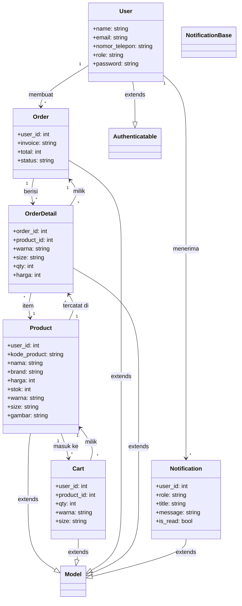

# Diagram Kelas Aplikasi Vast Hijab

```mermaid
classDiagram
    class User {
        +name: string
        +email: string
        +nomor_telepon: string
        +role: string
        +password: string
    }

    class Product {
        +user_id: int
        +kode_product: string
        +nama: string
        +brand: string
        +harga: int
        +stok: int
        +warna: string
        +size: string
        +gambar: string
    }

    class Cart {
        +user_id: int
        +product_id: int
        +qty: int
        +warna: string
        +size: string
    }

    class Order {
        +user_id: int
        +invoice: string
        +total: int
        +status: string
    }

    class OrderDetail {
        +order_id: int
        +product_id: int
        +warna: string
        +size: string
        +qty: int
        +harga: int
    }

    class Notification {
        +user_id: int
        +role: string
        +title: string
        +message: string
        +is_read: bool
    }

    User "1" --> "*" Order : membuat
    User "1" --> "*" Notification : menerima
    Product "1" --> "*" OrderDetail : tercatat di
    Product "1" --> "*" Cart : masuk ke
    Order "1" --> "*" OrderDetail : berisi
    OrderDetail "*" --> "1" Order : milik
    OrderDetail "*" --> "1" Product : item
    Cart "*" --> "1" Product : milik

    %% Inheritance untuk model Laravel
    class Model
    class Authenticatable
    class NotificationBase

    User --|> Authenticatable : extends
    Product --|> Model : extends
    Cart --|> Model : extends
    Order --|> Model : extends
    OrderDetail --|> Model : extends
    Notification --|> Model : extends
```
